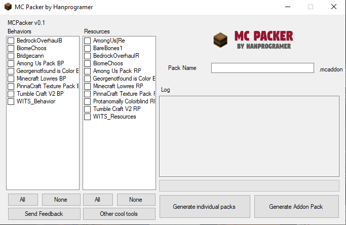

# MCPacker
Mc Packer is a program used to make .mcaddon file which user can doubble click to install your addon.
It can also merge packs together to a single click installation file (.mcpack)

 

<a class="downloadBtnReg" href="https://link-to.net/147407/mcpacker" target="_blank">Download via Linkvertise</a>